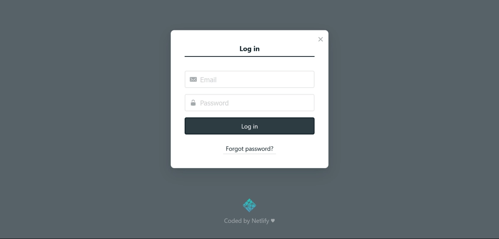
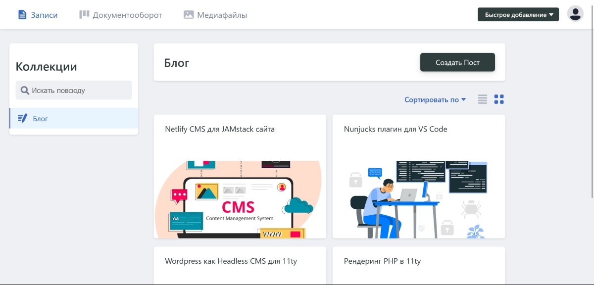
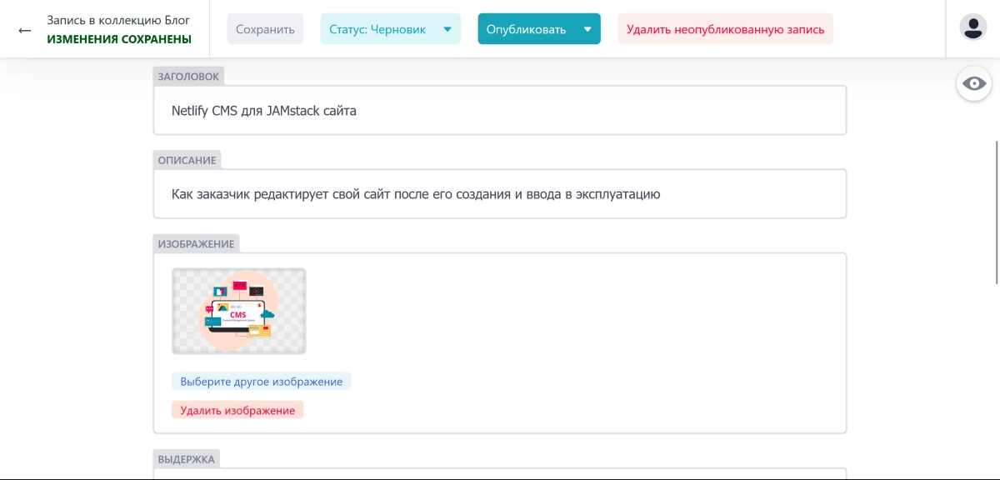
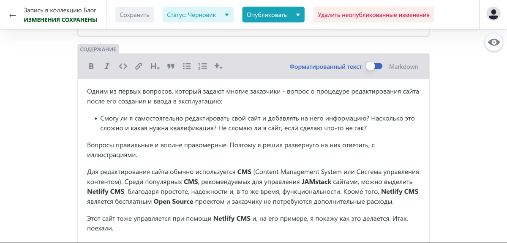
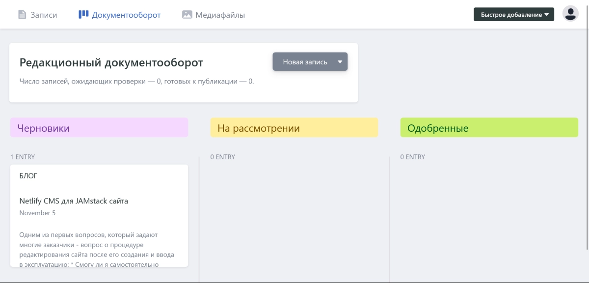
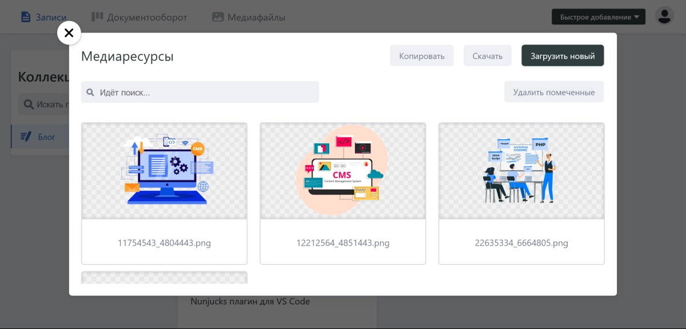

Одним из первых вопросов, который задают многие заказчики - вопрос о процедуре редактирования сайта после его создания и ввода в эксплуатацию:

> Смогу ли я самостоятельно редактировать свой сайт и добавлять на него информацию? Насколько это сложно и какая нужна квалификация? Не сломаю ли я сайт, если сделаю что-то не так?

Вопросы правильные и вполне правомерные. Поэтому я решил развёрнуто на них ответить, с иллюстрациями.

Для редактирования сайта обычно используется **CMS** (Content Management System или Система управления контентом). Среди популярных **CMS**, рекомендуемых для управления `Jamstack` сайтами, можно выделить **Netlify CMS**, благодаря простоте, надёжности и, в то же время, функциональности. Кроме того, **Netlify CMS** является бесплатным **Open Source** проектом и заказчику не потребуются дополнительные расходы.

Далее, на примере **Netlify CMS**, я покажу, как владелец или редактор сайта могут его редактировать.

При входе в панель управления сайтом **CMS** запросит ваш логин и пароль:

После успешной авторизации откроется панель управления сайтом **CMS Netlify**:

Здесь мы видим список всех страниц сайта, разделённых по коллекциям в левом столбце. В этом примере только одна коллекция - **Блог**, но сайт может состоять из множества коллекций - услуг, товаров, персоналий, анонсов, новостей и др.

При добавлении новой страницы в коллекцию, эта страница автоматически попадёт в нужное место на сайте, в соответствии с настройками коллекции. Для добавления страницы необходимо нажать на кнопку **Создать пост** в заголовке коллекции.

В режиме редактирования страницы можно указать заголовок страницы, краткое описание, прикрепить изображение, написать текст страницы и, при необходимости, указать другие свойства страницы:

Редактирование текста страницы ничем не отличается от других популярных текстовых редакторов и даже проще:

Во время редактирования страница имеет статус **Черновик** и все сохранённые изменения на странице не отражаются на сайте до проверки и публикации. Для публикации новой или изменённой страницы на сайте, необходимо её проверить, изменить статус на **Одобрено** и нажать на кнопку **Опубликовать**. Только после этого посетители сайта смогут увидеть новую страницу (при добавлении) или новую версию страницы (при изменении).

Для контроля за изменениями на сайте в **CMS Netlify** предусмотрен раздел **Документооборот**:

Здесь можно увидеть все, пока ещё неопубликованные, страницы, отсортированные по их статусам - **Черновики**, **На рассмотрении**, **Одобренные**. Это особенно полезно, если сайт редактирует не один человек, а команда.

Для управления изображениями и видео в **CMS Netlify** предусмотрен раздел **Медиаресурсы**:

Здесь можно загрузить изображение или видео на сайт, а также удалить неактуальные или устаревшие медиафайлы. Далее, на любой странице сайта можно разместить изображение или видео из этого раздела.

Как мы видим, в процедуре редактирования сайта нет ничего сложного и особая квалификация не требуется. С этим справится любой, кто имеет минимальный опыт работы с компьютером. А система контроля за изменениями не позволит случайно опубликовать незаконченную страницу и побуждает редактора сайта лишний раз проверить страницу перед её публикацией.
