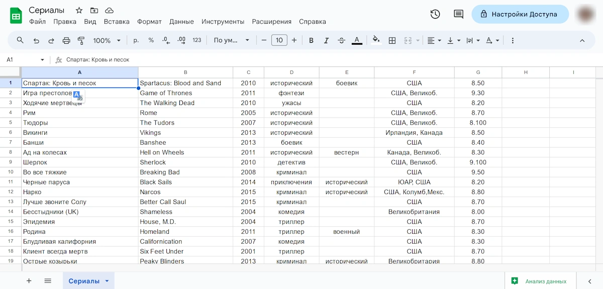
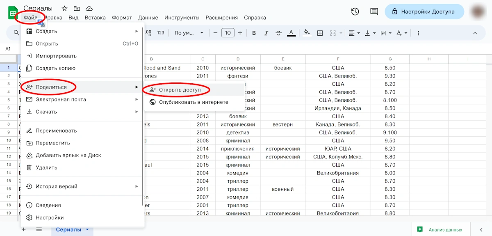
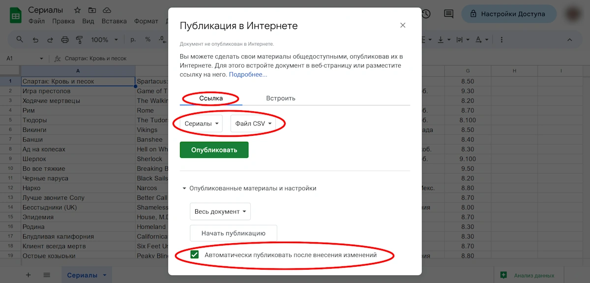
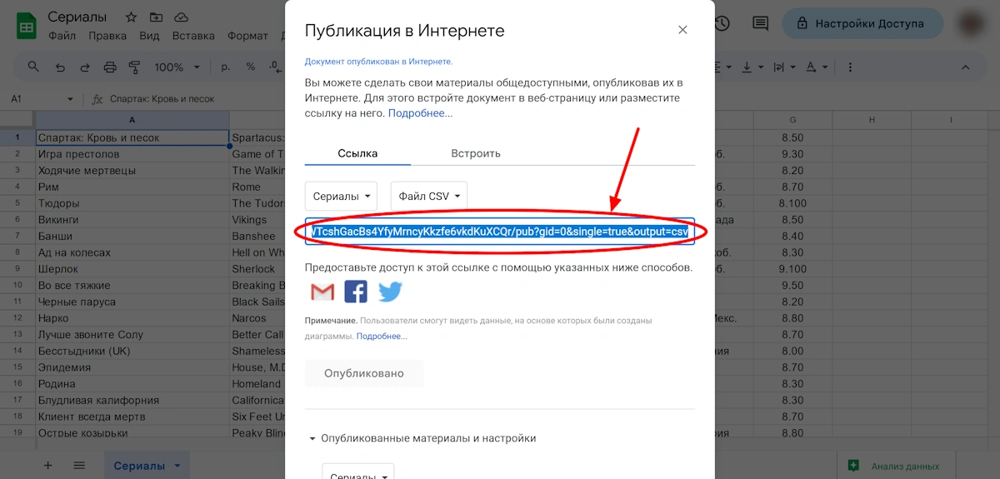

Иногда необходимо дать владельцу сайта возможность оперативно обновлять некоторую актуальную информацию на сайте, для редактирования которой нет смысла устанавливать и настраивать полноценную CMS. В таком случае, в качестве CMS, можно задействовать обычную Google-таблицу.

Далее я покажу как автоматически подгружать информацию из Google-таблицы для дальнейшей публикации на сайте.

1. Пример таблицы с информацией о сериалах:



2. Выдаём права на редактирование таблицы только владельцу и/или редакторам сайта:



3. Публикуем таблицу в Интернете:


4. В настройках публикации указываем какой лист из таблицы нужно опубликовать и в каком формате. Формат публикации – CSV. Кроме того, необходимо убедиться, что включена опция «Автоматически публиковать после внесения изменений»:



5. После нажатия на кнопку «Опубликовать» копируем публичную ссылку на опубликованную таблицу в формате CSV:



6. Простейший пример кода для загрузки и парсинга информации из Google-таблицы:

```js
// script.js
const serials = async () => {
  const response = await fetch(
    "https://docs.google.com/spreadsheets/d/e/.../pub?gid=0&single=true&output=csv"
  );
  if (response.ok) {
    const text = await response.text();
    const rows = text.split("\r\n");
    return rows.map((row) => {
      const fields = row.split(",");
      return {
        name: fields[0],
        original: fields[1],
        year: fields[2],
        genres: [fields[3], fields[4]],
        country: fields[5],
        rating: fields[6],
      };
    });
  } else {
    console.log(response.status);
    return [];
  }
};
```

В результате выполнения этого кода переменная `serials` будет содержать массив объектов, каждый из которых будет включать информацию об одном сериале.

Теперь информацию о сериалах можно вывести на любой странице сайта путём перебора массива `serials` в цикле. В идеале, для этого лучше использовать реактивный фреймворк (React, Vue, Svelte, Alpine и т.п.), но можно обойтись и ванильным JS. Перед публикацией массив `serials` можно отфильтровать по требуемым критериям и/или упорядочить по любому из столбцов.
