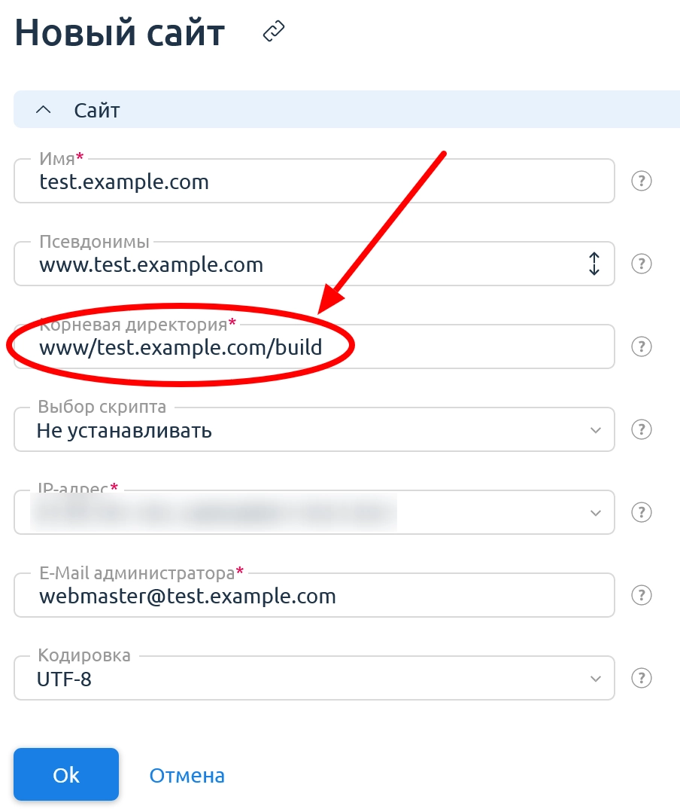

## Исходные условия

- Сайт, собранный на стеке **Jamstack** на **Node.js** (Astro), хостится на обычном (самом экономичном) виртуальном хостинге;
- Редактируется сайт при помощи **Headless CMS** (Wordpress), установленной на этом же виртуальном хостинге по отдельному адресу;
- При сборке сайта данные подтягиваются из CMS посредством **REST API** или **GraphQL**.

## Задача

Дать возможность заказчику сайта самостоятельно осуществлять сборку сайта прямо на хостинге после его редактирования, без необходимости:

- Хранить исходники проекта на своём компьютере;
- Входить с авторизацией на виртуальный хостинг;
- Выполнять какие-либо действия, не свойственные квалификации заказчика.

## Решение

1\. При создании сайта на хостинге, в качестве **корневой папки** указываем **подпапку** с наименованием, соответствующим наименованию итоговой папки при сборке проекта. Наименование этой папки различается у разных генераторов **Jamstack**, в нашем примере это папка `build`:

<span class="block max-w-sm mx-auto"></span>

2\. Загружаем все исходники проекта на хостинг, но не в корневую папку сайта `build`, а в папку на уровень выше. Таким образом, при сборке сайта на хостинге, корневая папка (она же итоговая папка сборки проекта) `build` будет создаваться/обновляться автоматически. При этом, загружать папку `node_modules` на хостинг не нужно, создадим её позже, прямо на хостинге.

3\. Устанавливаем на хостинг **Node.js** подходящей версии. В настоящее время это можно сделать практически на любом виртуальном хостинге даже при использовании **ISP Manager** (в **cPanel** подключение **Node.js** встроено по умолчанию). Если не удаётся найти готовую инструкцию по установке **Node.js** для своего хостинга - рекомендую обратиться в техподдержку, они помогут.

4\. Подключаемся к хостингу по **SSH**, переходим в папку проекта (на уровень выше папки `build`) и выполняем там команду `npm install` для создания папки `node_modules` и установки всех зависимостей. Дополнительно можно выполнить команду `npm run build`, чтобы убедиться, что сборка сайта происходит без ошибок.

Следующие шаги инструкции предназначены для пользователей, работающих под управлением операционной системы **Windows**, т.к. их подавляющее большинство. Для пользователей, работающих под управлением **macOS** или **Linux**, можно подготовить аналогичное решение.

5\. На своём компьютере создаём пустую папку c произвольным наименованием (например, Update) и загружаем в неё утилиту `plink.exe` из пакета **Putty**.

Утилиту `plink.exe` можно загрузить с [официального сайта](https://www.putty.org/), работает автономно, установка (инсталляция) и дополнительные файлы не требуются.

6\. В этой же папке, рядом с утилитой `plink.exe`, создаём файл `update.cmd` со следующим содержимым:

```bash
# update.cmd
@echo off
plink -ssh test.example.com -P 22 -l login -pw password
```

Адрес, порт, логин и пароль те же, что использовались в п.4 выше для подключения к хостингу по **SSH**.

При первом запуске командного файла `update.cmd` в консоли будет показан `hostkey` сервера с предложением подтвердить подключение и сохранить `hostkey` в локальном кэше на компьютере. Но, так как мы собираемся передать это решение заказчику для дальнейшего использования, сохранение `hostkey` сервера в локальном кэше разработчика не имеет никакого смысла.

7\. Поэтому, от сохранения `hostkey` сервера в локальном кэше отказываемся, а вместо этого просто копируем его и вставляем в командный файл `update.cmd` следующим образом:

```bash
# update.cmd
@echo off
plink -ssh test.example.com -P 22 -l login -pw password -hostkey SHA256:I3CsaM7VQKwh3tLu9Ol6z/gZSgQN3lpxkEGRz45oOIQ
```

8\. И последнее, что нужно сделать - добавить опцию `-batch`, чтобы команда выполнялась в пакетном режиме и не задавала лишних вопросов, а в кавычках прописать команды, которые необходимо выполнить после подключения к серверу, а именно - переход в нужную папку, запуск сборки проекта и выход:

```bash
# update.cmd
@echo off
plink -ssh -batch test.example.com -P 22 -l login -pw password -hostkey SHA256:I3CsaM7VQKwh3tLu9Ol6z/gZSgQN3lpxkEGRz45oOIQ "cd www/test.example.com; npm run build; exit"
```

Теперь, подготовленную папку с двумя файлами `plink.exe` и `update.cmd` можно передать заказчику, которому, для самостоятельной сборки сайта, достаточно будет запустить командный файл `update.cmd` на своём компьютере.

Естественно, заказчика необходимо дополнительно проинструктировать о недопустимости передачи этих файлов третьим лицам, так же как и логинов и паролей от хостинга и других облачных служб, во избежание взлома сайта с последующей потерей информации и возможных репутационных издержек.
